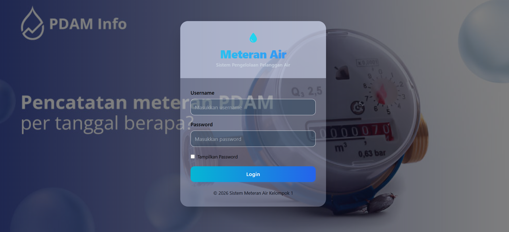
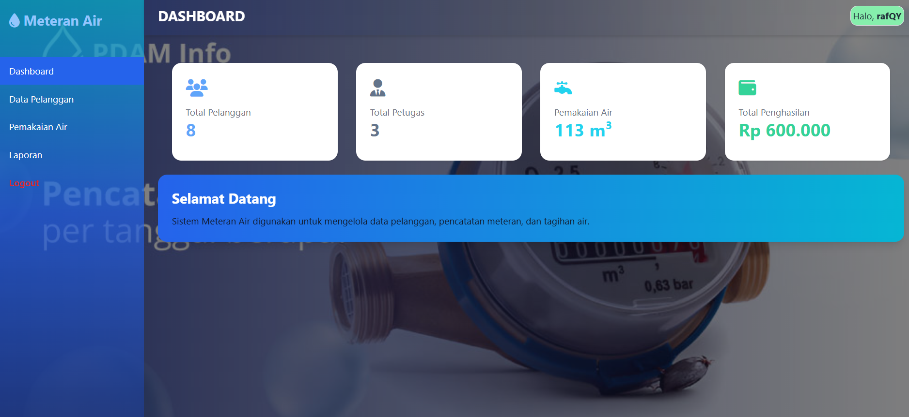
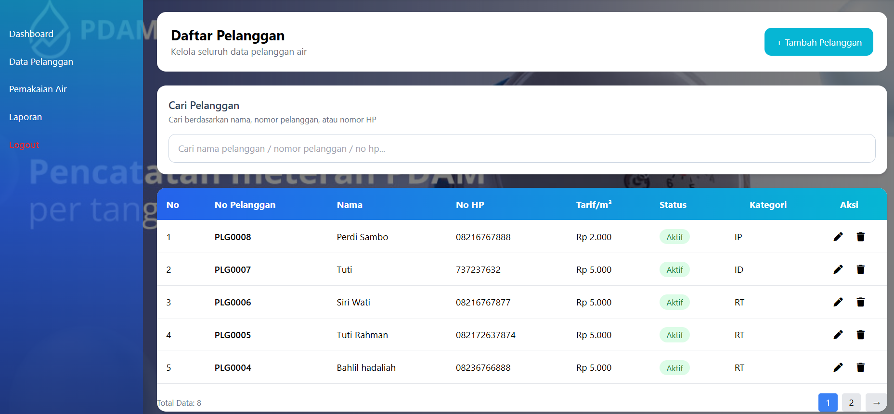
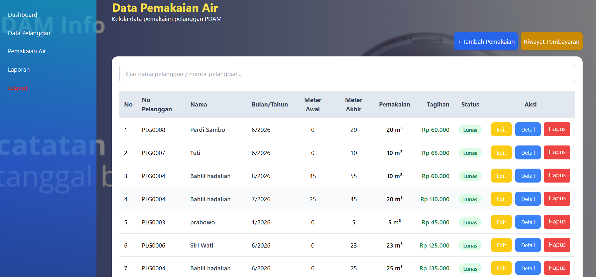
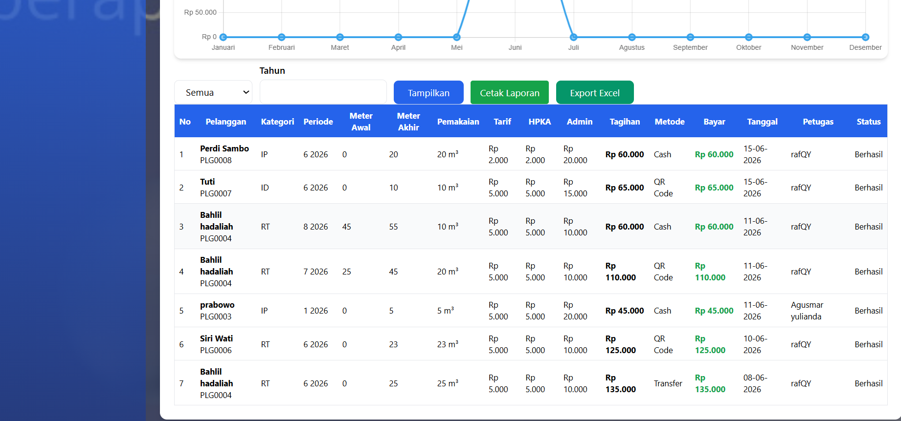

# Sistem Informasi Pembayaran Air PDAM

Sistem Informasi Pembayaran Air PDAM berbasis web yang dikembangkan sebagai Proyek Tugas Akhir Universitas Metamedia. Aplikasi ini digunakan untuk mengelola data pelanggan, pemakaian air, pembayaran tagihan, serta pembuatan laporan secara digital.

## Teknologi yang Digunakan

* PHP Native
* MySQL
* Tailwind CSS
* JavaScript
* HTML5 & CSS3

## Fitur Utama

* Login Administrator
* Dashboard Statistik
* Manajemen Data Pelanggan
* Input Pemakaian Air
* Pengelolaan Tagihan
* Pembayaran Tagihan
* Cetak Bukti Pembayaran
* Laporan Pembayaran
* Laporan Pemakaian Air
* Export Data

---

## Tampilan Aplikasi

### Halaman Login



### Dashboard



### Data Pelanggan



### Data Pemakaian Air



### Laporan 



---

## Cara Menjalankan Aplikasi

1. Import database ke MySQL melalui phpMyAdmin.
2. Sesuaikan konfigurasi database pada file:

```php
config/koneksi.php
```

3. Jalankan web server (XAMPP/Laragon).
4. Akses aplikasi melalui browser.

---

## Pengembang

**Nama:** [Rafqy,Agusmar,Dedek]

**Universitas:** Universitas Metamedia

**Program Studi:** Sistem Informasi

**Tahun:** 2026
